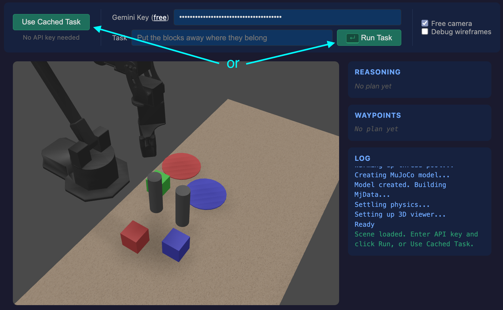

# Embodied reasoning hierarchical robotics pipeline demo

End-to-end Vision-Language-Action (VLA) models bundle perception, reasoning, and motor control into a single network, but that means the camera, kinematics, and training scenarios are all baked in together. This could cause [unexpected](https://www.avikde.me/debugging-as-architecture-insight) and [unresolvable](https://www.avikde.me/a-coding-agent-equivalent-for-robotics) issues when the task, embodiment, or environment change.

This demo combines the flexible task programming and reasoning of Gemini ER (what is the scene, and what should I do?) and classical camera calibration, kinematics, motion controllers. Each layer is independently swappable, and the AI model doesn't need to know anything about the robot's embodiment. This recreates the modularity of a [Sense-Plan-Act](https://www.avikde.me/the-architecture-behind-end-to-end) architecture while retaining the semantic reasoning of a foundation AI model.

```
👁️ Perception  ──►  🧠 Task Reasoning  ──►  📐 Spatial Understanding  ──►  ⚙️ Planning & Obstacle Avoidance  ──►  🤖 Motors
   (Gemini)             (Gemini)                (camera geometry)                   (IK / kinematics)
◄──────────── SENSE ────────────────────────────────────── PLAN ──────────────────────────────────────────────────► ACT ►
```

## Web demo (start here)

[](https://avikde.github.io/vla-pipeline/)

[](https://avikde.github.io/vla-pipeline/)


Try the browser-based demo with MuJoCo WASM + Three.js, no installation required:
- Grab your own [Gemini API key](https://ai.google.dev/gemini-api/docs/api-key) (free tier), or use the pre-baked fallback plan
- Click "Run Task" or "Use Cached Task" and watch!
- Use the mouse to orbit the camera, and check the console for debug logs

## Develop locally (optional)

The `web/` directory contains a fully client-side embodied reasoning demo using MuJoCo WASM + Three.js. No backend required.

```sh
git clone https://github.com/avikde/vla-pipeline.git
cd vla-pipeline
```

`brew install node`

```bash
node web/serve.js
# Open http://localhost:8080
```

## Architecture

### Browser demo (`web/`)

| Module | Role |
|--------|------|
| `web/main.js` | Entry point: init, Gemini pipeline, waypoint sequencing, animation loop |
| `web/mujoco-scene.js` | MuJoCo WASM init, Three.js rendering, MjvScene sync |
| `web/ik-solver.js` | JS port of `WidowXController` |
| `web/gemini-er.js` | JS port of `gemini_er_policy.py` + pre-baked fallback plan |
| `web/math-utils.js` | Linear algebra, rotation math, pixel-to-3D projection |

Stack: [`@mujoco/mujoco`](https://www.npmjs.com/package/@mujoco/mujoco) WASM (CDN), [Three.js](https://threejs.org/) v0.170 (CDN), Gemini API via `fetch()`.

### WidowX

**Action representation (EE6D):** 10D per timestep = [x, y, z, r1x, r1y, r1z, r2x, r2y, r2z, gripper]. The 6D rotation uses two columns of the rotation matrix (third reconstructed via cross product).

## Acknowledgements

- **WidowX model:** From [google-deepmind/mujoco_menagerie](https://github.com/google-deepmind/mujoco_menagerie/tree/main/trossen_wx250s)
- **Google Gemini Robotics ER** [model and description](https://ai.google.dev/gemini-api/docs/robotics-overview)
- **Claude Code** was used for implementation and debugging
